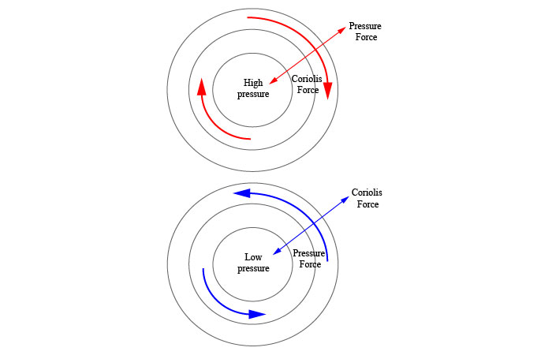

# Chapter 6: Atmospheric Pressure, Wind, and Global Circulation
#### Instructor: Lynne Beatty
#### Spring 2018

## Learning Objectives:

- What factors influence air pressure?

    > Factors of air pressure include air density, temperature, and altitude. Higher density, lower temperatures and lower altitude mean higher air pressure.

- Interpret a map of isobars.

    > Isobars are isolines that connect points of equal atmospheric pressure.

- Draw and describe the patterns of general atmospheric circulation around high and low pressure systems.

- What is advection?

    > Advection is the horizontal transfer of air. Air will move from high-pressure systems to low pressure systems.

- Explain the four driving forces that determine wind speed and direction.

    > Unequal heating of land surfaces, the pressure gradient force, the Coriolis force, and the various frictional forces all effect wind speed and direction.
    > - Coriolis force deflects or pulls the atmosphere as the Earth rotates.
    > - Frictional forces is the interaction between wind and the Earth surfaces.
    > - The tropics heat more than the polar regions.
    > - Pressure gradient is the movement of air from high pressure to low pressure systems.

- Locate and describe the pressure cells on Earth.

    > The Hadley cell is the tropical circulatory system between the equator and about 30 degrees N and S.
    >

- How do the jet streams and Rossby waves affect our weather?

- Describe the formation of local winds (monsoon, land-sea breeze, and topographic winds) and where they occur.

- Describe the benefits of using wind as an energy resource in Kansas.

- What are the driving forces for surface currents and for deep ocean currents?

- Understand the general patterns or gyres of circulation in the ocean at the surface and with depth.

- Explain the roles of atmospheric pressure, wind, and ocean circulation in forming an El Nino.

#### Assignment: Due Feb 19, 2300.

[Discussion: Contribute one correct answer.](https://online.jccc.edu/d2l/le/content/111557/viewContent/2044753/View)