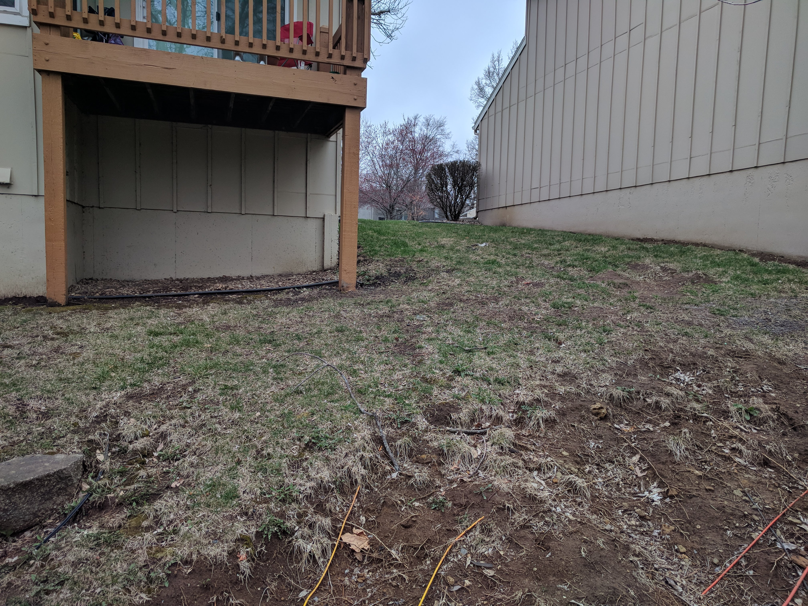
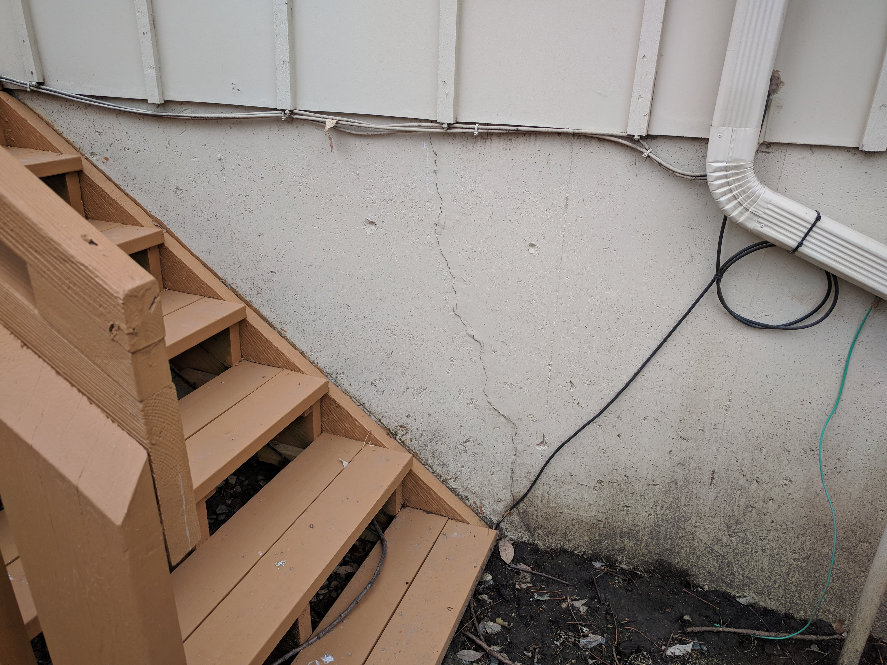
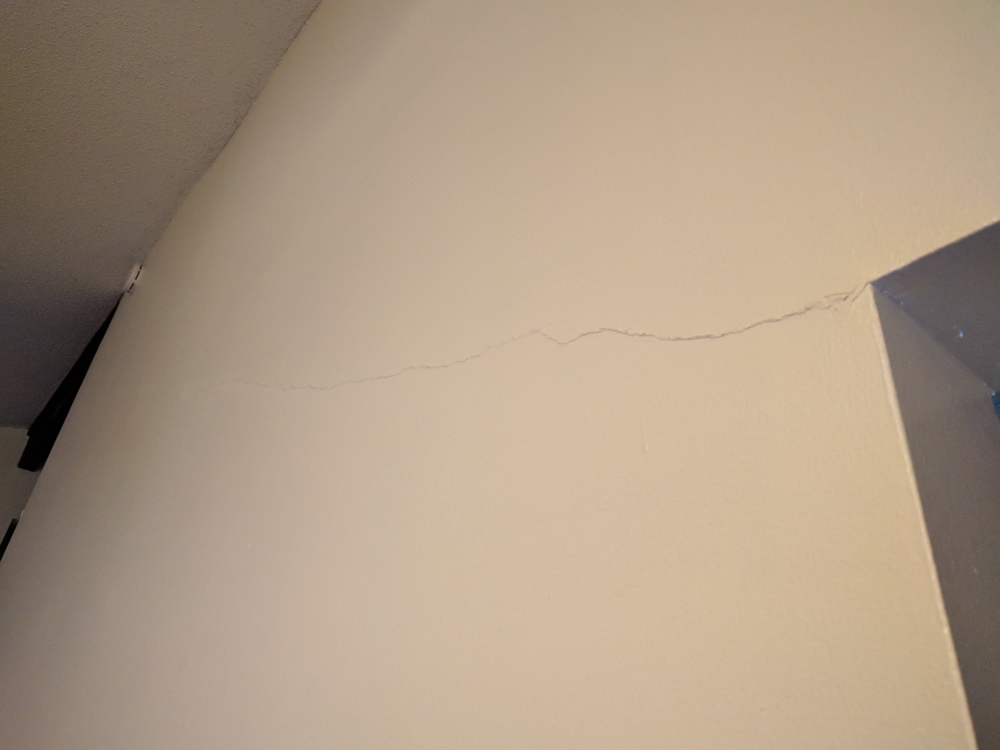
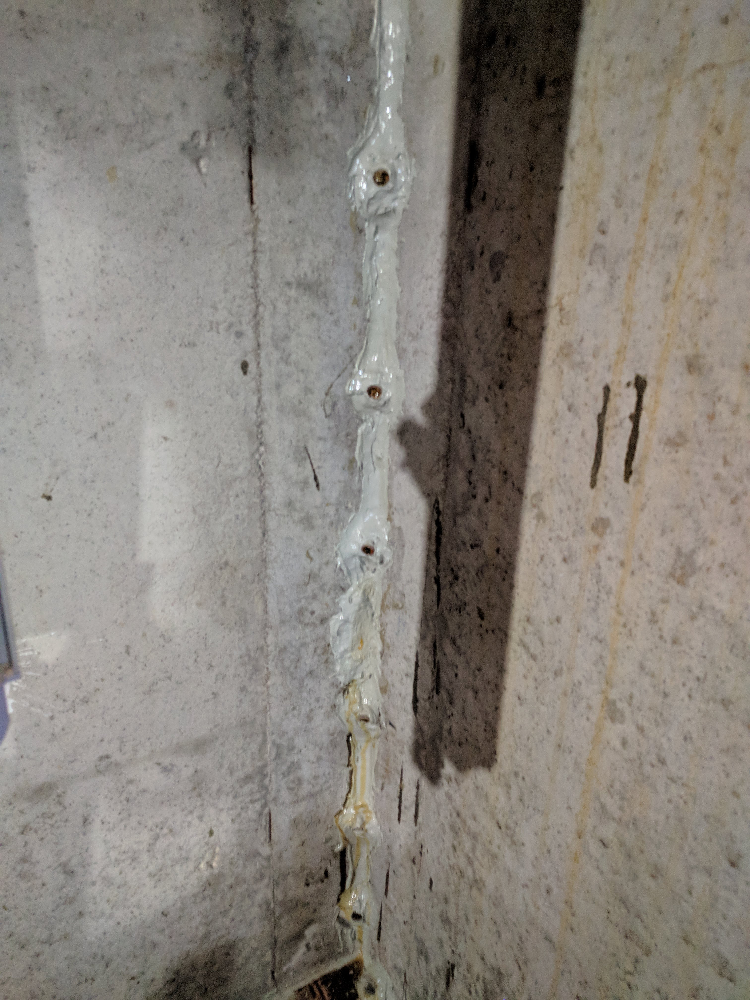

# Physical Geography Homework: Buying a House

## Chapter 14: Weathering and Mass Movement

----

Author: Jon Volden

Date: 3/29/2018

Instructor: Lynne Beatty

Course: GEOS140

#### Introduction

The house I chose to examine is the house I'm renting in Overland Park, KS, built in the 1970s. After living in this house for almost 3 years, I've noticed quite a few weathering processes happening. The property the house sits on is particularly good for this assignment because of the slope from the street to the back of the house. (Shown in pictures)

#### The Signs

The first sign of movement I discovered was the wall in the main living area. There is a very noticeable crack going from one doorway almost to the ceiling, evidence of the house settling after being built. The next sign came when pulling into the garage after school one night, and it was raining from the garage ceiling. After determining it was from the upstairs bathroom not draining, a plumber was called. It turned out, that the soil under the foundation had settled about two feet. This settling pulled apart a t-section in the main drain. The next year, water in the basement led me to the next sign. During the thawing after one winter freeze, water began to run from the corner of the basement to a drain about 15 feet away. Finally, the internet going out when it rained was the, (hopefully) last sign of weathering I've noticed. As seen in the pictures, erosion behind the house is exposing various communication lines to my house and a neighbors. One of those lines had bad insulation and shorted our internet connection when it rained.

#### Explanations

The crack on the wall, foundation settling, and crack in the basement wall can primarily be explained by soil creep. The house sits on an incline and this speeds up the soil creep due to gravity. Over the past 30 years this has caused the house to rack slightly. In order to prevent a larger landslide the backyard has a retaining wall running along the length of the property. This wall has most likely prevented much worse settling. The crack in the basement wall can be attributed to two possibilities. The crack probably originated from the house settling and was widened by frost wedging. As the water seeped into the original crack, the process of freezing expanded the crack. This allowed the crack to get slightly bigger during each freeze and thaw. The soil being removed and exposing the wires can simply be explained by erosion from water.

#### Potentials

The biggest threat this house faces is the fact that it sits on a slope. Given the right conditions, a mudflow or debris flow could happen. In this case the retaining wall serves another purpose, it should show signs of moving long before a flow happens.

#### Pictures

Retaining wall showing erosion between the stones.

Soil erosion in the backyard exposing communication lines.

Showing the slope from front to back of house.

Crack on the back of the house. More signs of settling.

Crack on interior wall.

Repair work of a basement crack that was leaking water. The holes in the wall is where the resin was injected into the wall.

