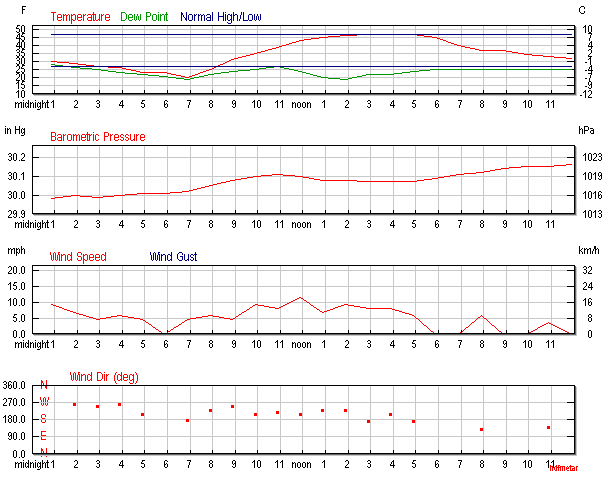
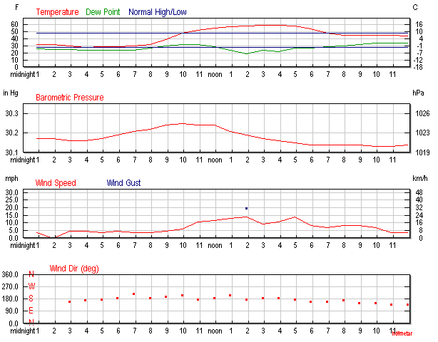
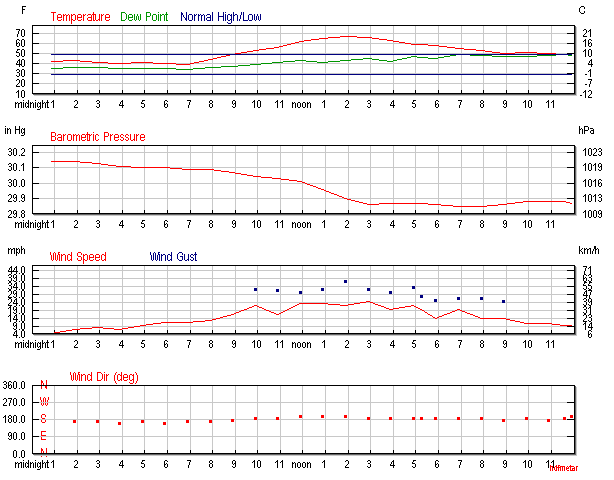
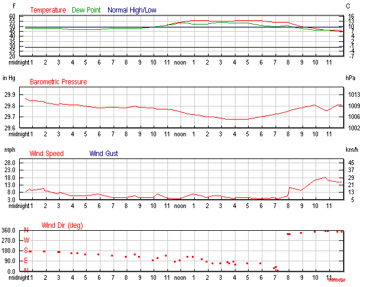

# GEOS140: Physical Geography Weather Report

#### Name: Jon Volden
#### Instructor: Lynne Beatty

### Table of Contents:
<!-- MarkdownTOC -->

- [Assignment](#assignment)
- [Resources](#resources)
- [Grading Rubric](#grading-rubric)
- [Weather Observation Project](#weather-observation-project)
    - [Introduction](#introduction)
    - [Methods](#methods)
    - [Results](#results)
    - [Daily Summary](#daily-summary)
    - [Graphs](#graphs)
    - [Interpretations/Analysis](#interpretationsanalysis)
    - [Reference Graphs](#reference-graphs)

<!-- /MarkdownTOC -->

# Assignment

**Data Collection:  Morning of February 25 through evening of February 28**
**Report due March 5 by 11 pm**

This assignment involves observing, collecting, and interpreting weather phenomena.  To show how conditions can change over several days, collect the information over 4 days at three different times each:  morning, afternoon, and evening.  It doesn’t have to be the exact same times each day.  This will take about 5 minutes each time.  Your observations should include the following for those times: (See data)

----

# Resources

Recommended resources for this assignment:

1.  Your personal observations of cloud types and fog whenever you are outside or passing by a window. If you have a rain gauge or outdoor thermometer at home, you could also use those.

2.  Weather Underground http://www.wunderground.com/
To switch to metric units, go to the upper right corner of the web page and click on the gear symbol. Enter your zip code or town, state, and country and Search.  There will be several weather stations, use an official site such as an airport or radio/tv station.  Select Full Forecast.  You will need to make a personal observation for the actual cloud or fog types.    Record the data in a data table that you make.   If you miss a data collection time, scroll down and find the History/Almanac Section.  Change the date and get what data you are missing.

3.  Textbook

----

# Grading Rubric

Your typed report should include the following sections

1. Introduction – purpose

2. Methods – where (which weather station) or how (personally collected) did you get the weather data?

3. Results - in the form of a data table that you made

4. Brief Summary for each day – “On Thursday the low was 13 C at 5:53 am and the high was 29 C at 4 pm. No precipitation occurred.  Friday brought a change in the wind direction and temperatures dropped to a low of 4 C at 6:22 am with a high temperature of only 18 C.   0.22 millimeters of rain fell.”

5. Graphs should include:

    * temperature and dew point with time
    * relative humidity with time
    * barometric pressure with time
    * precipitation with time if appropriate

    If you use a spreadsheet for your data table (like excel) graphs are easy to make! You can also construct graphs by hand on graph paper. All graphs should have appropriate scales, labels, and titles.

6. Interpretations and analysis - about the weather system(s) over this area during the study. Use the graphs to help you explain patterns or relationships between the weather variables.  You will need to discuss the relationship between temperature and relative humidity, the passage of warm and cold fronts if applicable, any lifting mechanisms and precipitation, and the high and low pressure systems that formed as supported by the data you collected or observed.

Proofread your report or ask someone else to proofread it.

----

# Weather Observation Project

## Introduction

During the period between February 25th and February 28th, data was collected and compared to illustrate weather changes over the course of four days. Data collected included temperature, dew point temperature, relative humidity, barometric pressure, wind speed and direction, cloud conditions, and precipitation.

## Methods

Information was gathered though online resources and local observation at home in Overland Park. Additional observations were made at Johnson County Community College. The online resource used was https://www.wunderground.com. Observations were made to collect cloud conditions and directional wind information was compared to online data. Online data was preferred for accuracy. Personal graphs were generated using www.OnlineChartTool.com.

## Results

| Date/Time | Temp | Dewpoint | Humidity | Baro Pressure | Wind Speed | Wind Dir | Clouds | Precip |
|-----------|-----:|--------:|----------:|--------------:|-----------:|---------:|----------:|-------:|
| Feb. 25, 0900 | 2.2 C | -3.3 C | 67% | 1019.3 hPa | 4.1 m/s | SSW | Clear | None |
| Feb. 25, 1500 | 8.9 C | -5.0 C | 37% | 1018.2 hPa | 3.6 m/s | SSW | Cloudy | None |
| Feb. 25, 2200 | 1.7 C | -3.3 C | 70% | 1029.8 hPa | Calm | Calm | Clear | None |
| Feb. 26, 0900 | 3.9 C | -1.1 C | 70% | 1023.8 hPa | 2.1 m/s | SSW | Clear | None |
| Feb. 26, 1500 | 15.0 C | -4.4 C | 26% | 1021.7 hPa | 4.1 m/s | S | Clear | None |
| Feb. 26, 2200 | 7.2 C | 1.1 C | 65% | 1020.1 hPa | 3.1 m/s | SSE | Clear | None |
| Feb. 27, 0900 | 9.4 C | 2.8 C | 64% | 1018.2 hPa | 7.2 m/s | S | Clear | None |
| Feb. 27, 1500 | 17.2 C | 5.6 C | 46% | 1011.4 hPa | 8.7 m/s | S | Partly Cloudy | None |
| Feb. 27, 2200 | 10.6 C | 8.3 C | 86% | 1011.6 hPa | 4.6 m/s | S | Cloudy | None |
| Feb. 28, 0900 | 8.9 C | 8.9 C | 100% | 1008.8 hPa | 2.1 m/s | SSE | Cloudy | None |
| Feb. 28, 1500 | 12.8 C | 12.2 C | 96% | 1005.0 hPa | 2.1 m/s | E | Cloudy | None |
| Feb. 28, 2200 | 8.9 C | 7.8 C | 93% | 1009.3 hPa | 7.2 m/s | N | Cloudy | None |

Numerical Data: [Source](https://www.wunderground.com)
Visual Data: Local observation

## Daily Summary

* On Sunday, Feb. 25, the low was -6.1 C at 0700. The high reached 8.9 C at 1700. The winds started from the west and changed directions to the south east by the end of the night. Skies were clear in the morning and became partly cloudy in the afternoon and for the rest of the day with no precipitation.

* On Monday temperatures warmed with the low at -2.2 C at 0400. The high reached 15 C by 1500. Calm winds and clear skies persisted all day with no precipitation.

* On Tuesday,temperatures continuted to warm. The high was 15.0 C and the low was 9.4 C. By the afternoon the skys were mostly cloudy for the rest of the day.

* On Wednesday, the high was 12.8 C with a low of 8.9 C. The skies were mostly cloudy with close to 100% humidity all day.

## Graphs

## Interpretations/Analysis

The week started out with calm, mild weather. The air was cool and dry with a low relative humidity and high pressure compared to the rest of the week. Temperatures warmed and pressure dropped over the next four days, along with increasing humidity. By Wednesday, the dew point temperature was near or equal to the air temperature producing 100% relative humidity.

The data shows the relationship between pressure and relative humidity is inversely proportional. Higher pressure air cannot hold as much water vapor as low pressure air. Over the next four days the pressure dropped sand therefor allowed increased capacity for water vapor. As the water vapor in the air increased, this also raised the dew point temperature, or temperature at which the air cannot hold any more water vapor. The data shows 100% humidity was reached on Wednesday morning.

On Sunday, the temperatures and humidity was low, and the pressure was high compared to the rest of the week. This indicates a cool, high pressure system with calm winds. As the pressure dropped we saw an increased in winds and mostly cloudy skies. This indicated a warmer, low pressure system moved in. The wind direction was from the south indicating the low pressure system came from the south, bringing with it warmer temperatures, moisture, and cloudy skies.

## Reference Graphs

February 25

February 26

February 27

February 28

Provided by www.wunderground.com